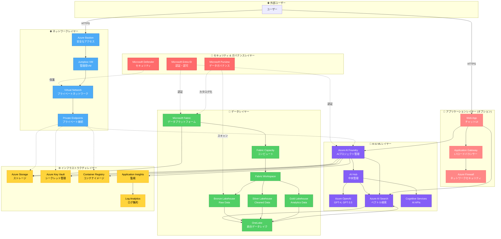
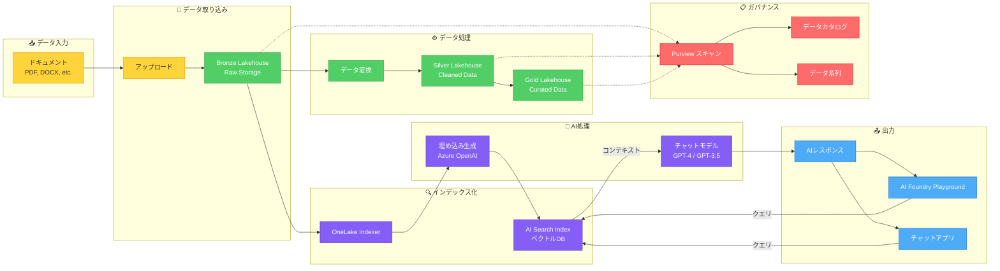
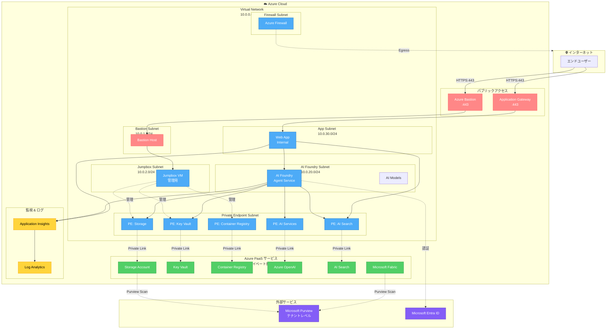
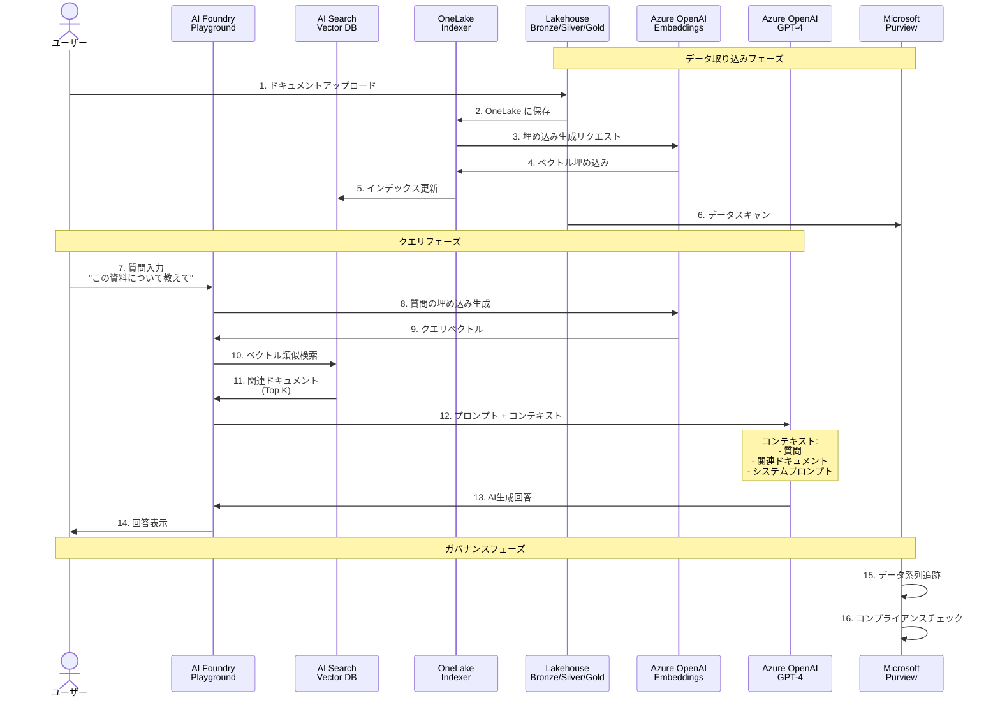

# Azure AI Application Architecture

このドキュメントでは、Deploy Your AI Application In Productionソリューションのアーキテクチャを視覚化します。

## アーキテクチャ概要図 (レイヤー別)

---

## データフロー図

---

## ネットワークアーキテクチャ図

---

## デプロイメントフロー図

---

## RAG (Retrieval-Augmented Generation) フロー図

---

## コンポーネント一覧

### セキュリティ & ガバナンス
| コンポーネント | 用途 |
|---------------|------|
| Microsoft Entra ID | 認証・認可・アクセス管理 |
| Microsoft Purview | データカタログ、系列追跡、DSPM |
| Microsoft Defender | セキュリティ監視・保護 |
| Azure Key Vault | シークレット・証明書管理 |

### ネットワーキング
| コンポーネント | 用途 |
|---------------|------|
| Virtual Network | プライベートネットワーク (10.0.0.0/16) |
| Private Endpoints | PaaSサービスへのプライベート接続 |
| Azure Bastion | セキュアなVM管理アクセス |
| Jumpbox VM | 管理用仮想マシン |
| Azure Firewall | アウトバウンドトラフィック制御 |
| Private DNS Zones | プライベートエンドポイント名前解決 |

### AI & 機械学習
| コンポーネント | 用途 |
|---------------|------|
| Azure AI Foundry | AIプロジェクト開発・管理プラットフォーム |
| AI Hub | 中央集約型AI管理 |
| Azure OpenAI | GPT-4, GPT-3.5, Embeddings モデル |
| Azure AI Search | ベクトル検索、セマンティック検索 |
| Cognitive Services | 各種AI APIサービス |

### データプラットフォーム
| コンポーネント | 用途 |
|---------------|------|
| Microsoft Fabric | 統合データ分析プラットフォーム |
| Fabric Capacity | コンピュートリソース (F8 SKU) |
| Fabric Workspace | データ資産の論理コンテナ |
| Bronze Lakehouse | Rawデータ保存 |
| Silver Lakehouse | クレンジング済みデータ |
| Gold Lakehouse | 分析用キュレートデータ |
| OneLake | Fabric統合データレイク |

### インフラストラクチャ
| コンポーネント | 用途 |
|---------------|------|
| Storage Account | Blob, File, Table, Queue ストレージ |
| Container Registry | コンテナイメージ管理 |
| Application Insights | アプリケーション監視・APM |
| Log Analytics | ログ集約・分析 |

### アプリケーション (オプション)
| コンポーネント | 用途 |
|---------------|------|
| Web App | チャットUIホスティング |
| Application Gateway | L7ロードバランサー・WAF |

---

## デプロイ時間の内訳

| フェーズ | 所要時間 | 主要リソース |
|---------|---------|-------------|
| **Pre-Provision** | 1-2分 | クォータチェック、パラメータ検証 |
| **コアインフラ** | 5-10分 | VNet, Storage, Key Vault, Container Registry |
| **AI インフラ** | 10-15分 | AI Hub, OpenAI, AI Search, AI Foundry, Models |
| **データインフラ** | 5-10分 | Fabric Capacity, Workspace, Lakehouses |
| **ネットワーク** | 5-10分 | Private Endpoints, Bastion, Jumpbox VM, DNS |
| **Post-Provision** | 10-15分 | Purview統合, RBAC, インデックス作成 |
| **合計** | **~45分** | 全体 |

---

## セキュリティ設計

### 多層防御アーキテクチャ

```mermaid
graph LR
    subgraph Layer1["Layer 1: ID/認証"]
        EntraID[Entra ID<br/>Multi-Factor Auth]
        RBAC[Azure RBAC]
    end

    subgraph Layer2["Layer 2: ネットワーク"]
        NSG[Network Security Groups]
        Firewall[Azure Firewall]
        PrivateLink[Private Link]
    end

    subgraph Layer3["Layer 3: データ"]
        Encryption[保存時暗号化<br/>Azure Storage Encryption]
        TLS[転送時暗号化<br/>TLS 1.2+]
        KeyVault[Key Vault<br/>キー管理]
    end

    subgraph Layer4["Layer 4: アプリケーション"]
        ManagedID[Managed Identity<br/>パスワードレス認証]
        WAF[Web Application Firewall]
        APIGateway[API Management]
    end

    subgraph Layer5["Layer 5: 監視/ガバナンス"]
        Defender[Microsoft Defender]
        Sentinel[Microsoft Sentinel]
        Purview[Microsoft Purview]
        AuditLogs[監査ログ]
    end

    EntraID --> RBAC
    RBAC --> NSG
    NSG --> Firewall
    Firewall --> PrivateLink
    PrivateLink --> Encryption
    Encryption --> TLS
    TLS --> KeyVault
    KeyVault --> ManagedID
    ManagedID --> WAF
    WAF --> APIGateway
    APIGateway --> Defender
    Defender --> Sentinel
    Sentinel --> Purview
    Purview --> AuditLogs

    classDef layer1 fill:#ff6b6b,stroke:#c92a2a,color:#fff
    classDef layer2 fill:#4dabf7,stroke:#1971c2,color:#fff
    classDef layer3 fill:#51cf66,stroke:#2f9e44,color:#fff
    classDef layer4 fill:#ffd43b,stroke:#f59f00,color:#000
    classDef layer5 fill:#845ef7,stroke:#5f3dc4,color:#fff

    class EntraID,RBAC layer1
    class NSG,Firewall,PrivateLink layer2
    class Encryption,TLS,KeyVault layer3
    class ManagedID,WAF,APIGateway layer4
    class Defender,Sentinel,Purview,AuditLogs layer5
```

---

## 参考資料

- [Azure AI Foundry Documentation](https://learn.microsoft.com/azure/ai-foundry/)
- [Microsoft Fabric Documentation](https://learn.microsoft.com/fabric/)
- [Azure AI Search Documentation](https://learn.microsoft.com/azure/search/)
- [Microsoft Purview Documentation](https://learn.microsoft.com/purview/)
- [Azure Well-Architected Framework](https://learn.microsoft.com/azure/well-architected/)
