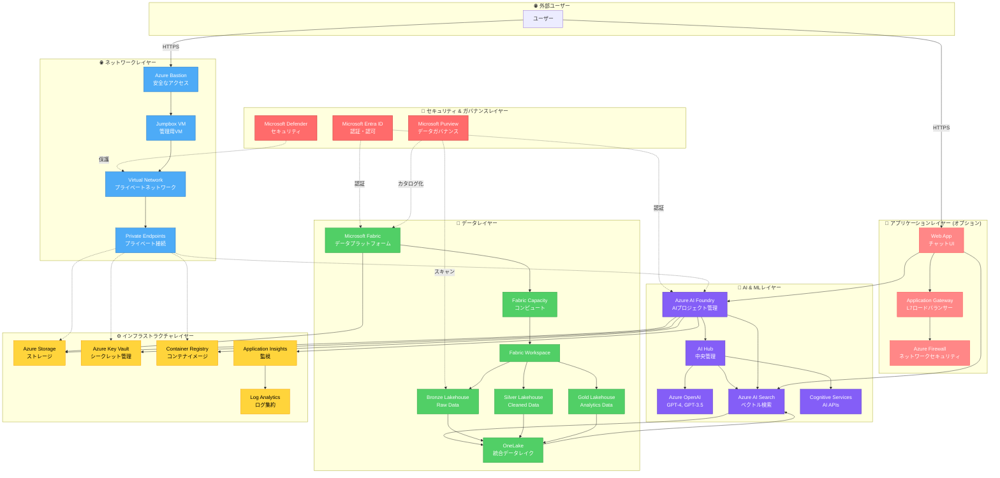
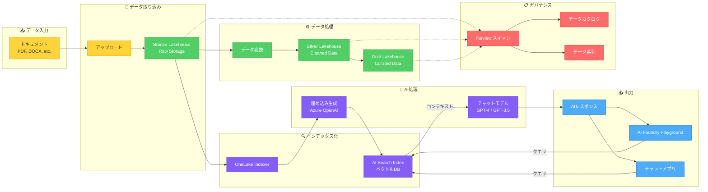
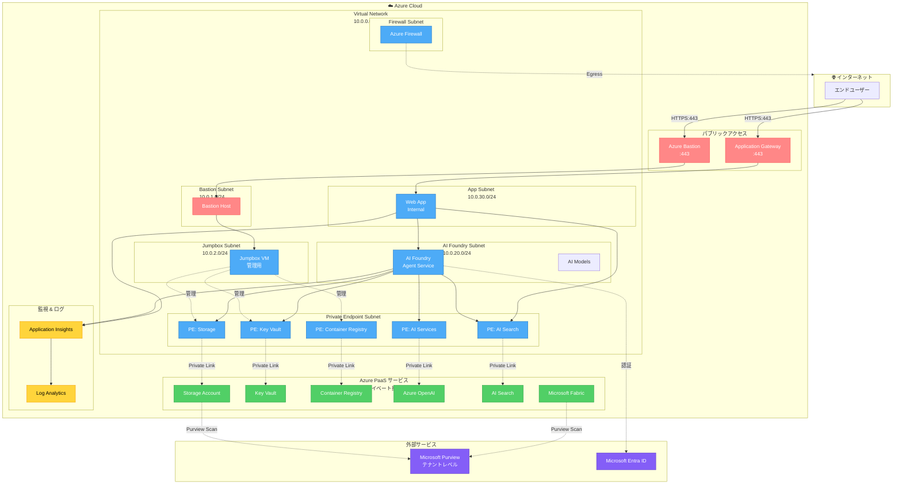
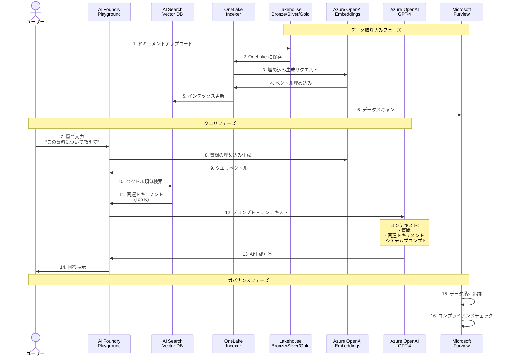
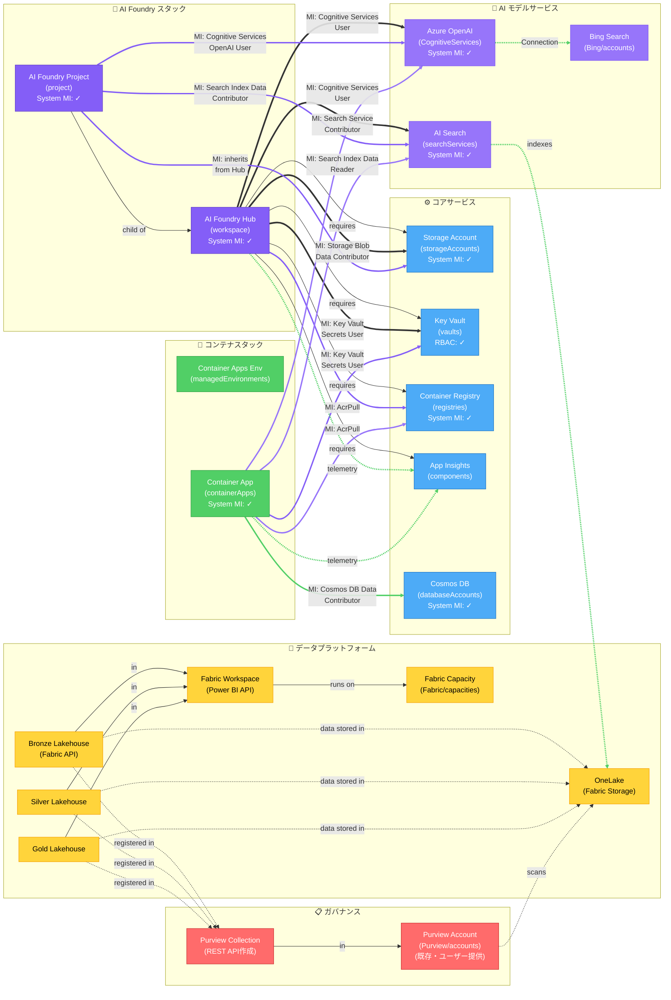

# Azure AI Application Architecture

このドキュメントでは、Deploy Your AI Application In Productionソリューションのアーキテクチャを視覚化します。

## アーキテクチャ概要図 (レイヤー別)

---

## データフロー図

---

## ネットワークアーキテクチャ図

---

## デプロイメントフロー図

```mermaid
graph TB
    Start([azd up 実行])

    subgraph PreProvision["🔧 Pre-Provision"]
        CheckQuota[クォータチェック]
        ValidateParams[パラメータ検証]
    end

    subgraph CoreInfra["🏗️ コアインフラ (5-10分)"]
        DeployRG[リソースグループ作成]
        DeployVNet[Virtual Network]
        DeployStorage[Storage Account]
        DeployKeyVault[Key Vault]
        DeployACR[Container Registry]
        DeployLog[Log Analytics]
    end

    subgraph AIInfra["🤖 AI インフラ (10-15分)"]
        DeployAIHub[AI Hub]
        DeployOpenAI[Azure OpenAI]
        DeployAISearch[AI Search]
        DeployAIFoundry[AI Foundry Project]
        DeployModels[AI Models デプロイ]
    end

    subgraph DataInfra["💾 データインフラ (5-10分)"]
        DeployFabricCap[Fabric Capacity]
        DeployWorkspace[Fabric Workspace]
        DeployLakehouses[Lakehouses 作成]
    end

    subgraph Networking["🌐 ネットワーク (5-10分)"]
        DeployPE[Private Endpoints]
        DeployBastion[Azure Bastion]
        DeployJumpVM[Jumpbox VM]
        ConfigDNS[Private DNS Zones]
    end

    subgraph PostProvision["⚙️ Post-Provision (10-15分)"]
        CreateCollection[Purview Collection 作成]
        RegisterDS[Fabric データソース登録]
        CreateLH[Lakehouse セットアップ]
        TriggerScan[Purview スキャン]
        SetupRBAC[RBAC 設定]
        UploadDocs[サンプルドキュメント]
        CreateIndex[AI Search Index]
    end

    Complete([✅ デプロイ完了<br/>~45分])

    Start --> CheckQuota
    CheckQuota --> ValidateParams
    ValidateParams --> DeployRG

    DeployRG --> DeployVNet
    DeployVNet --> DeployStorage
    DeployStorage --> DeployKeyVault
    DeployKeyVault --> DeployACR
    DeployACR --> DeployLog

    DeployLog --> DeployAIHub
    DeployAIHub --> DeployOpenAI
    DeployOpenAI --> DeployAISearch
    DeployAISearch --> DeployAIFoundry
    DeployAIFoundry --> DeployModels

    DeployModels --> DeployFabricCap
    DeployFabricCap --> DeployWorkspace
    DeployWorkspace --> DeployLakehouses

    DeployLakehouses --> DeployPE
    DeployPE --> DeployBastion
    DeployBastion --> DeployJumpVM
    DeployJumpVM --> ConfigDNS

    ConfigDNS --> CreateCollection
    CreateCollection --> RegisterDS
    RegisterDS --> CreateLH
    CreateLH --> TriggerScan
    TriggerScan --> SetupRBAC
    SetupRBAC --> UploadDocs
    UploadDocs --> CreateIndex

    CreateIndex --> Complete

    %% Styling
    classDef prep fill:#ffd43b,stroke:#f59f00,color:#000
    classDef infra fill:#4dabf7,stroke:#1971c2,color:#fff
    classDef ai fill:#845ef7,stroke:#5f3dc4,color:#fff
    classDef data fill:#51cf66,stroke:#2f9e44,color:#fff
    classDef network fill:#ff8787,stroke:#fa5252,color:#fff
    classDef post fill:#74c0fc,stroke:#339af0,color:#000

    class CheckQuota,ValidateParams prep
    class DeployRG,DeployVNet,DeployStorage,DeployKeyVault,DeployACR,DeployLog infra
    class DeployAIHub,DeployOpenAI,DeployAISearch,DeployAIFoundry,DeployModels ai
    class DeployFabricCap,DeployWorkspace,DeployLakehouses data
    class DeployPE,DeployBastion,DeployJumpVM,ConfigDNS network
    class CreateCollection,RegisterDS,CreateLH,TriggerScan,SetupRBAC,UploadDocs,CreateIndex post
```

---

## RAG (Retrieval-Augmented Generation) フロー図

---

## コンポーネント一覧

### セキュリティ & ガバナンス
| コンポーネント | 用途 |
|---------------|------|
| Microsoft Entra ID | 認証・認可・アクセス管理 |
| Microsoft Purview | データカタログ、系列追跡、DSPM |
| Microsoft Defender | セキュリティ監視・保護 |
| Azure Key Vault | シークレット・証明書管理 |

### ネットワーキング
| コンポーネント | 用途 |
|---------------|------|
| Virtual Network | プライベートネットワーク (10.0.0.0/16) |
| Private Endpoints | PaaSサービスへのプライベート接続 |
| Azure Bastion | セキュアなVM管理アクセス |
| Jumpbox VM | 管理用仮想マシン |
| Azure Firewall | アウトバウンドトラフィック制御 |
| Private DNS Zones | プライベートエンドポイント名前解決 |

### AI & 機械学習
| コンポーネント | 用途 |
|---------------|------|
| Azure AI Foundry | AIプロジェクト開発・管理プラットフォーム |
| AI Hub | 中央集約型AI管理 |
| Azure OpenAI | GPT-4, GPT-3.5, Embeddings モデル |
| Azure AI Search | ベクトル検索、セマンティック検索 |
| Cognitive Services | 各種AI APIサービス |

### データプラットフォーム
| コンポーネント | 用途 |
|---------------|------|
| Microsoft Fabric | 統合データ分析プラットフォーム |
| Fabric Capacity | コンピュートリソース (F8 SKU) |
| Fabric Workspace | データ資産の論理コンテナ |
| Bronze Lakehouse | Rawデータ保存 |
| Silver Lakehouse | クレンジング済みデータ |
| Gold Lakehouse | 分析用キュレートデータ |
| OneLake | Fabric統合データレイク |

### インフラストラクチャ
| コンポーネント | 用途 |
|---------------|------|
| Storage Account | Blob, File, Table, Queue ストレージ |
| Container Registry | コンテナイメージ管理 |
| Application Insights | アプリケーション監視・APM |
| Log Analytics | ログ集約・分析 |

### アプリケーション (オプション)
| コンポーネント | 用途 |
|---------------|------|
| Web App | チャットUIホスティング |
| Application Gateway | L7ロードバランサー・WAF |

---

## デプロイ時間の内訳

| フェーズ | 所要時間 | 主要リソース |
|---------|---------|-------------|
| **Pre-Provision** | 1-2分 | クォータチェック、パラメータ検証 |
| **コアインフラ** | 5-10分 | VNet, Storage, Key Vault, Container Registry |
| **AI インフラ** | 10-15分 | AI Hub, OpenAI, AI Search, AI Foundry, Models |
| **データインフラ** | 5-10分 | Fabric Capacity, Workspace, Lakehouses |
| **ネットワーク** | 5-10分 | Private Endpoints, Bastion, Jumpbox VM, DNS |
| **Post-Provision** | 10-15分 | Purview統合, RBAC, インデックス作成 |
| **合計** | **~45分** | 全体 |

---

## セキュリティ設計

### 多層防御アーキテクチャ

```mermaid
graph LR
    subgraph Layer1["Layer 1: ID/認証"]
        EntraID[Entra ID<br/>Multi-Factor Auth]
        RBAC[Azure RBAC]
    end

    subgraph Layer2["Layer 2: ネットワーク"]
        NSG[Network Security Groups]
        Firewall[Azure Firewall]
        PrivateLink[Private Link]
    end

    subgraph Layer3["Layer 3: データ"]
        Encryption[保存時暗号化<br/>Azure Storage Encryption]
        TLS[転送時暗号化<br/>TLS 1.2+]
        KeyVault[Key Vault<br/>キー管理]
    end

    subgraph Layer4["Layer 4: アプリケーション"]
        ManagedID[Managed Identity<br/>パスワードレス認証]
        WAF[Web Application Firewall]
        APIGateway[API Management]
    end

    subgraph Layer5["Layer 5: 監視/ガバナンス"]
        Defender[Microsoft Defender]
        Sentinel[Microsoft Sentinel]
        Purview[Microsoft Purview]
        AuditLogs[監査ログ]
    end

    EntraID --> RBAC
    RBAC --> NSG
    NSG --> Firewall
    Firewall --> PrivateLink
    PrivateLink --> Encryption
    Encryption --> TLS
    TLS --> KeyVault
    KeyVault --> ManagedID
    ManagedID --> WAF
    WAF --> APIGateway
    APIGateway --> Defender
    Defender --> Sentinel
    Sentinel --> Purview
    Purview --> AuditLogs

    classDef layer1 fill:#ff6b6b,stroke:#c92a2a,color:#fff
    classDef layer2 fill:#4dabf7,stroke:#1971c2,color:#fff
    classDef layer3 fill:#51cf66,stroke:#2f9e44,color:#fff
    classDef layer4 fill:#ffd43b,stroke:#f59f00,color:#000
    classDef layer5 fill:#845ef7,stroke:#5f3dc4,color:#fff

    class EntraID,RBAC layer1
    class NSG,Firewall,PrivateLink layer2
    class Encryption,TLS,KeyVault layer3
    class ManagedID,WAF,APIGateway layer4
    class Defender,Sentinel,Purview,AuditLogs layer5
```

---

## Azureリソースベースのアーキテクチャ図

このセクションでは、実際にデプロイされる**具体的なAzureリソース**とその相互関係を詳細に示します。

### リソースグループビュー - 全体構成

```mermaid
graph TB
    subgraph RG["🗂️ Resource Group: rg-{baseName}"]
        subgraph Networking["🌐 ネットワークリソース"]
            VNet["Virtual Network<br/>Microsoft.Network/<br/>virtualNetworks<br/>vnet-{baseName}"]
            NSG1["NSG: pe-subnet<br/>Microsoft.Network/<br/>networkSecurityGroups"]
            NSG2["NSG: jumpbox-subnet<br/>Microsoft.Network/<br/>networkSecurityGroups"]
            NSG3["NSG: agent-subnet<br/>Microsoft.Network/<br/>networkSecurityGroups"]
            NSG4["NSG: bastion-subnet<br/>Microsoft.Network/<br/>networkSecurityGroups"]
            NSG5["NSG: appgw-subnet<br/>Microsoft.Network/<br/>networkSecurityGroups"]
            Bastion["Azure Bastion<br/>Microsoft.Network/<br/>bastionHosts<br/>bastion-{baseName}"]
            AppGW["Application Gateway<br/>Microsoft.Network/<br/>applicationGateways<br/>appgw-{baseName}"]
            PublicIP1["Public IP<br/>pip-bastion-{baseName}"]
            PublicIP2["Public IP<br/>pip-appgw-{baseName}"]
        end

        subgraph PrivateEndpoints["🔌 Private Endpoints"]
            PE_Storage["PE: Storage<br/>Microsoft.Network/<br/>privateEndpoints<br/>pe-st-{baseName}"]
            PE_KeyVault["PE: Key Vault<br/>pe-kv-{baseName}"]
            PE_ACR["PE: Container Registry<br/>pe-acr-{baseName}"]
            PE_OpenAI["PE: OpenAI<br/>pe-openai-{baseName}"]
            PE_Search["PE: AI Search<br/>pe-search-{baseName}"]
            PE_CosmosDB["PE: Cosmos DB<br/>pe-cosmos-{baseName}"]
            PE_AppConfig["PE: App Config<br/>pe-appconfig-{baseName}"]
            PE_ContainerEnv["PE: Container Apps<br/>pe-aca-{baseName}"]
        end

        subgraph VMs["💻 仮想マシン"]
            JumpVM["Jumpbox VM<br/>Microsoft.Compute/<br/>virtualMachines<br/>vm-jump-{baseName}<br/>(Windows Server 2022)"]
            JumpNIC["NIC: vm-jump-nic"]
            JumpDisk["Disk: vm-jump-osdisk"]
            BuildVM["Build VM<br/>Microsoft.Compute/<br/>virtualMachines<br/>vm-build-{baseName}<br/>(Ubuntu 22.04)"]
            BuildNIC["NIC: vm-build-nic"]
            BuildDisk["Disk: vm-build-osdisk"]
        end

        subgraph Storage["💾 ストレージ & データ"]
            StorageAccount["Storage Account<br/>Microsoft.Storage/<br/>storageAccounts<br/>st{baseName}<br/>(Standard_LRS)"]
            CosmosDB["Cosmos DB<br/>Microsoft.DocumentDB/<br/>databaseAccounts<br/>cosmos-{baseName}<br/>(SQL API)"]
            AppConfig["App Configuration<br/>Microsoft.AppConfiguration/<br/>configurationStores<br/>appconfig-{baseName}"]
        end

        subgraph Security["🔑 セキュリティ"]
            KeyVault["Key Vault<br/>Microsoft.KeyVault/vaults<br/>kv-{baseName}<br/>(Premium)"]
        end

        subgraph Containers["🐳 コンテナ"]
            ACR["Container Registry<br/>Microsoft.ContainerRegistry/<br/>registries<br/>cr{baseName}<br/>(Premium)"]
            ContainerEnv["Container Apps Environment<br/>Microsoft.App/<br/>managedEnvironments<br/>cae-{baseName}"]
            ContainerApp1["Container App 1<br/>Microsoft.App/<br/>containerApps<br/>ca-frontend-{baseName}"]
            ContainerApp2["Container App 2<br/>Microsoft.App/<br/>containerApps<br/>ca-backend-{baseName}"]
        end

        subgraph AIServices["🤖 AI & 検索"]
            AIHub["AI Foundry Hub<br/>Microsoft.MachineLearning<br/>Services/workspaces<br/>aihub-{baseName}"]
            AIProject["AI Foundry Project<br/>Microsoft.MachineLearning<br/>Services/workspaces<br/>aiproject-{baseName}"]
            OpenAI["Azure OpenAI<br/>Microsoft.CognitiveServices/<br/>accounts<br/>openai-{baseName}<br/>(Kind: AIServices)"]
            ModelGPT4["Model: GPT-4o<br/>Microsoft.CognitiveServices/<br/>accounts/deployments<br/>gpt-4o"]
            ModelGPT35["Model: GPT-3.5-turbo<br/>gpt-35-turbo"]
            ModelEmbed["Model: Embeddings<br/>text-embedding-3-large"]
            AISearch["AI Search<br/>Microsoft.Search/<br/>searchServices<br/>search-{baseName}<br/>(Standard)"]
            BingSearch["Bing Search<br/>Microsoft.Bing/accounts<br/>bing-{baseName}"]
        end

        subgraph Monitoring["📊 監視"]
            LogAnalytics["Log Analytics<br/>Microsoft.Operational<br/>Insights/workspaces<br/>log-{baseName}"]
            AppInsights["Application Insights<br/>Microsoft.Insights/<br/>components<br/>appi-{baseName}"]
        end

        subgraph Fabric["🏭 Microsoft Fabric"]
            FabricCapacity["Fabric Capacity<br/>Microsoft.Fabric/<br/>capacities<br/>fabric-{baseName}<br/>(F8 SKU)"]
        end
    end

    subgraph External["🌐 外部リソース (ユーザー提供)"]
        PurviewAccount["Microsoft Purview<br/>Microsoft.Purview/<br/>accounts<br/>(既存アカウント)"]
        EntraID["Microsoft Entra ID<br/>(テナントレベル)"]
    end

    %% Network connections
    VNet -.->|contains| NSG1
    VNet -.->|contains| NSG2
    VNet -.->|contains| NSG3
    VNet -.->|contains| NSG4
    VNet -.->|contains| NSG5
    VNet -.->|contains| PE_Storage
    VNet -.->|contains| PE_KeyVault
    VNet -.->|contains| PE_ACR
    VNet -.->|contains| PE_OpenAI
    VNet -.->|contains| PE_Search
    Bastion -->|connects| JumpVM
    PublicIP1 -->|assigned to| Bastion
    PublicIP2 -->|assigned to| AppGW

    %% VM connections
    JumpVM -->|uses| JumpNIC
    JumpVM -->|uses| JumpDisk
    JumpNIC -.->|in subnet| VNet
    BuildVM -->|uses| BuildNIC
    BuildVM -->|uses| BuildDisk
    BuildNIC -.->|in subnet| VNet

    %% Private Endpoints
    PE_Storage -->|connects to| StorageAccount
    PE_KeyVault -->|connects to| KeyVault
    PE_ACR -->|connects to| ACR
    PE_OpenAI -->|connects to| OpenAI
    PE_Search -->|connects to| AISearch
    PE_CosmosDB -->|connects to| CosmosDB
    PE_AppConfig -->|connects to| AppConfig
    PE_ContainerEnv -->|connects to| ContainerEnv

    %% AI Foundry dependencies
    AIHub -->|depends on| StorageAccount
    AIHub -->|depends on| KeyVault
    AIHub -->|depends on| AppInsights
    AIHub -->|depends on| ACR
    AIProject -->|child of| AIHub
    AIProject -->|uses| OpenAI
    AIProject -->|uses| AISearch
    OpenAI -->|hosts| ModelGPT4
    OpenAI -->|hosts| ModelGPT35
    OpenAI -->|hosts| ModelEmbed
    OpenAI -->|connected to| BingSearch

    %% Container Apps
    ContainerEnv -->|hosts| ContainerApp1
    ContainerEnv -->|hosts| ContainerApp2
    ContainerApp1 -->|pulls from| ACR
    ContainerApp2 -->|pulls from| ACR
    ContainerApp1 -->|uses| KeyVault
    ContainerApp1 -->|uses| OpenAI
    ContainerApp1 -->|uses| AISearch

    %% Monitoring
    AppInsights -->|sends to| LogAnalytics
    AIHub -->|logs to| AppInsights
    ContainerEnv -->|logs to| LogAnalytics
    StorageAccount -->|logs to| LogAnalytics
    KeyVault -->|logs to| LogAnalytics

    %% Fabric
    FabricCapacity -.->|scanned by| PurviewAccount

    %% External
    AIHub -.->|auth via| EntraID
    ContainerApp1 -.->|auth via| EntraID

    %% Styling
    classDef network fill:#4dabf7,stroke:#1971c2,color:#fff
    classDef security fill:#ff6b6b,stroke:#c92a2a,color:#fff
    classDef storage fill:#51cf66,stroke:#2f9e44,color:#fff
    classDef compute fill:#ffd43b,stroke:#f59f00,color:#000
    classDef ai fill:#845ef7,stroke:#5f3dc4,color:#fff
    classDef monitoring fill:#74c0fc,stroke:#339af0,color:#000
    classDef fabric fill:#ff8787,stroke:#fa5252,color:#fff
    classDef external fill:#868e96,stroke:#495057,color:#fff

    class VNet,NSG1,NSG2,NSG3,NSG4,NSG5,Bastion,AppGW,PublicIP1,PublicIP2,PE_Storage,PE_KeyVault,PE_ACR,PE_OpenAI,PE_Search,PE_CosmosDB,PE_AppConfig,PE_ContainerEnv network
    class KeyVault security
    class StorageAccount,CosmosDB,AppConfig storage
    class JumpVM,JumpNIC,JumpDisk,BuildVM,BuildNIC,BuildDisk,ACR,ContainerEnv,ContainerApp1,ContainerApp2 compute
    class AIHub,AIProject,OpenAI,ModelGPT4,ModelGPT35,ModelEmbed,AISearch,BingSearch ai
    class LogAnalytics,AppInsights monitoring
    class FabricCapacity fabric
    class PurviewAccount,EntraID external
```

---

### リソース依存関係とManaged Identity接続

この図は、リソース間の**依存関係**と**Managed Identityによる認証**を示します。

**凡例**:
- `-->` : 構成依存（リソース作成時に必要）
- `==>` : Managed Identity による RBAC 接続（実行時認証）
- `-.->` : データフロー / 参照関係

---

### ネットワーク詳細図 - VNet、サブネット、Private Endpoints

```mermaid
graph TB
    subgraph Internet["🌐 インターネット"]
        Users["エンドユーザー"]
    end

    subgraph AzureRegion["☁️ Azure Region: East US 2"]
        subgraph PublicZone["パブリックゾーン"]
            PIP_Bastion["Public IP<br/>pip-bastion<br/>Standard<br/>Static"]
            PIP_AppGW["Public IP<br/>pip-appgw<br/>Standard<br/>Static"]
        end

        subgraph VNet["Virtual Network: vnet-{baseName}<br/>Address Space: 10.0.0.0/16<br/>Microsoft.Network/virtualNetworks"]

            subgraph Subnet_Bastion["🔒 Bastion Subnet<br/>10.0.1.0/26<br/>Name: AzureBastionSubnet"]
                BastionHost["Azure Bastion<br/>bastion-{baseName}<br/>Microsoft.Network/<br/>bastionHosts<br/>SKU: Standard"]
            end

            subgraph Subnet_Jumpbox["💻 Jumpbox Subnet<br/>10.0.2.0/24<br/>NSG: nsg-jumpbox"]
                JumpVM["Jumpbox VM<br/>vm-jump-{baseName}<br/>Microsoft.Compute/<br/>virtualMachines<br/>SKU: Standard_D2s_v3<br/>OS: Windows Server 2022"]
            end

            subgraph Subnet_Build["🏗️ Build Subnet<br/>10.0.3.0/24<br/>NSG: nsg-build"]
                BuildVM["Build VM<br/>vm-build-{baseName}<br/>Microsoft.Compute/<br/>virtualMachines<br/>SKU: Standard_D4s_v3<br/>OS: Ubuntu 22.04"]
            end

            subgraph Subnet_PE["🔌 Private Endpoint Subnet<br/>10.0.10.0/24<br/>NSG: nsg-pe"]
                PE1["PE: Storage<br/>pe-st-{baseName}<br/>Target: st{baseName}<br/>Group ID: blob"]
                PE2["PE: Key Vault<br/>pe-kv-{baseName}<br/>Target: kv-{baseName}<br/>Group ID: vault"]
                PE3["PE: ACR<br/>pe-acr-{baseName}<br/>Target: cr{baseName}<br/>Group ID: registry"]
                PE4["PE: OpenAI<br/>pe-openai-{baseName}<br/>Target: openai-{baseName}<br/>Group ID: account"]
                PE5["PE: AI Search<br/>pe-search-{baseName}<br/>Target: search-{baseName}<br/>Group ID: searchService"]
                PE6["PE: Cosmos DB<br/>pe-cosmos-{baseName}<br/>Target: cosmos-{baseName}<br/>Group ID: Sql"]
                PE7["PE: App Config<br/>pe-appconfig-{baseName}<br/>Target: appconfig-{baseName}<br/>Group ID: configurationStores"]
                PE8["PE: Container Apps<br/>pe-aca-{baseName}<br/>Target: cae-{baseName}<br/>Group ID: managedEnvironments"]
            end

            subgraph Subnet_Agent["🤖 AI Agent Subnet<br/>10.0.20.0/24<br/>NSG: nsg-agent"]
                AgentService["AI Foundry Agent Service<br/>(Managed by Microsoft)<br/>Workspace Managed VNet"]
            end

            subgraph Subnet_AppGW["🚪 App Gateway Subnet<br/>10.0.30.0/24<br/>NSG: nsg-appgw"]
                AppGW["Application Gateway<br/>appgw-{baseName}<br/>Microsoft.Network/<br/>applicationGateways<br/>SKU: WAF_v2<br/>Capacity: 2-125"]
            end

            subgraph Subnet_Container["🐳 Container Apps Subnet<br/>10.0.40.0/23<br/>NSG: nsg-aca<br/>Delegated: Microsoft.App/<br/>environments"]
                ContainerEnv["Container Apps Env<br/>cae-{baseName}<br/>Microsoft.App/<br/>managedEnvironments"]
            end
        end

        subgraph PrivateDNS["Private DNS Zones<br/>(14 zones)"]
            DNS1["privatelink.blob<br/>.core.windows.net"]
            DNS2["privatelink.vault<br/>core.azure.net"]
            DNS3["privatelink.azurecr.io"]
            DNS4["privatelink.openai<br/>.azure.com"]
            DNS5["privatelink.search<br/>.windows.net"]
            DNS6["privatelink.documents<br/>.azure.com"]
            DNS7["privatelink.azconfig.io"]
            DNS8["privatelink.azure<br/>containerapps.io"]
            DNS9["privatelink.api<br/>.azureml.ms"]
            DNS10["+ 5 more zones..."]
        end

        subgraph PaaSServices["🔐 PaaS Services (Private Link)"]
            Storage["Storage Account<br/>st{baseName}<br/>Public Access: Disabled"]
            KeyVault["Key Vault<br/>kv-{baseName}<br/>Public Access: Disabled"]
            ACR["Container Registry<br/>cr{baseName}<br/>Public Access: Disabled"]
            OpenAI["Azure OpenAI<br/>openai-{baseName}<br/>Public Access: Disabled"]
            AISearch["AI Search<br/>search-{baseName}<br/>Public Access: Disabled"]
            CosmosDB["Cosmos DB<br/>cosmos-{baseName}<br/>Public Access: Disabled"]
            AppConfig["App Config<br/>appconfig-{baseName}<br/>Public Access: Disabled"]
        end
    end

    %% User connections
    Users -->|HTTPS:443| PIP_Bastion
    Users -->|HTTPS:443| PIP_AppGW

    %% Bastion connections
    PIP_Bastion -->|assigned to| BastionHost
    BastionHost -->|RDP:3389| JumpVM
    BastionHost -->|SSH:22| BuildVM

    %% App Gateway
    PIP_AppGW -->|assigned to| AppGW
    AppGW -->|backend pool| ContainerEnv

    %% Private Endpoint connections
    PE1 -.->|Private Link| Storage
    PE2 -.->|Private Link| KeyVault
    PE3 -.->|Private Link| ACR
    PE4 -.->|Private Link| OpenAI
    PE5 -.->|Private Link| AISearch
    PE6 -.->|Private Link| CosmosDB
    PE7 -.->|Private Link| AppConfig
    PE8 -.->|Private Link| ContainerEnv

    %% DNS resolution
    PE1 -.->|A record| DNS1
    PE2 -.->|A record| DNS2
    PE3 -.->|A record| DNS3
    PE4 -.->|A record| DNS4
    PE5 -.->|A record| DNS5
    PE6 -.->|A record| DNS6
    PE7 -.->|A record| DNS7
    PE8 -.->|A record| DNS8

    %% VNet Link
    DNS1 -.->|linked to| VNet
    DNS2 -.->|linked to| VNet
    DNS3 -.->|linked to| VNet
    DNS4 -.->|linked to| VNet
    DNS5 -.->|linked to| VNet

    %% VM access to services
    JumpVM -.->|via PE| Storage
    JumpVM -.->|via PE| KeyVault
    JumpVM -.->|via PE| OpenAI
    BuildVM -.->|via PE| ACR
    BuildVM -.->|via PE| Storage

    %% Styling
    classDef public fill:#ff8787,stroke:#fa5252,color:#fff
    classDef subnet fill:#74c0fc,stroke:#339af0,color:#000
    classDef vm fill:#ffd43b,stroke:#f59f00,color:#000
    classDef pe fill:#51cf66,stroke:#2f9e44,color:#fff
    classDef dns fill:#845ef7,stroke:#5f3dc4,color:#fff
    classDef paas fill:#4dabf7,stroke:#1971c2,color:#fff

    class PIP_Bastion,PIP_AppGW public
    class Subnet_Bastion,Subnet_Jumpbox,Subnet_Build,Subnet_PE,Subnet_Agent,Subnet_AppGW,Subnet_Container subnet
    class JumpVM,BuildVM,BastionHost,AppGW vm
    class PE1,PE2,PE3,PE4,PE5,PE6,PE7,PE8 pe
    class DNS1,DNS2,DNS3,DNS4,DNS5,DNS6,DNS7,DNS8,DNS9,DNS10 dns
    class Storage,KeyVault,ACR,OpenAI,AISearch,CosmosDB,AppConfig paas
```

---

### AI Foundry リソーススタック詳細

```mermaid
graph TB
    subgraph AIFoundryHub["🏢 AI Foundry Hub<br/>Microsoft.MachineLearningServices/workspaces<br/>aihub-{baseName}"]
        HubIdentity["System Managed Identity<br/>Principal ID: {guid}"]
        HubConfig["Configuration:<br/>- Storage: st{baseName}<br/>- Key Vault: kv-{baseName}<br/>- App Insights: appi-{baseName}<br/>- Container Registry: cr{baseName}"]
    end

    subgraph AIFoundryProject["📁 AI Foundry Project<br/>Microsoft.MachineLearningServices/workspaces<br/>aiproject-{baseName}<br/>Kind: Project"]
        ProjectIdentity["System Managed Identity<br/>Principal ID: {guid}"]
        ProjectHub["Hub Reference:<br/>Workspace ID: {hub-id}"]
    end

    subgraph Dependencies["📦 必須依存リソース"]
        Storage["Storage Account<br/>Microsoft.Storage/<br/>storageAccounts<br/>st{baseName}<br/>- Containers:<br/>  └ azureml<br/>  └ default<br/>  └ code<br/>- File Shares:<br/>  └ code"]

        KeyVault["Key Vault<br/>Microsoft.KeyVault/vaults<br/>kv-{baseName}<br/>- Secrets stored:<br/>  └ storage-account-key<br/>  └ app-insights-key<br/>  └ acr-password"]

        AppInsights["App Insights<br/>Microsoft.Insights/<br/>components<br/>appi-{baseName}<br/>- Instrumentation Key<br/>- Connection String"]

        ACR["Container Registry<br/>Microsoft.Container<br/>Registry/registries<br/>cr{baseName}<br/>- Repositories:<br/>  └ azureml<br/>  └ environments"]
    end

    subgraph AIModels["🧠 AI モデルリソース"]
        OpenAI["Azure OpenAI<br/>Microsoft.Cognitive<br/>Services/accounts<br/>openai-{baseName}<br/>Kind: AIServices<br/>SKU: S0"]

        Model1["Deployment 1:<br/>gpt-4o<br/>Microsoft.Cognitive<br/>Services/accounts/<br/>deployments<br/>Capacity: 10K TPM"]

        Model2["Deployment 2:<br/>gpt-35-turbo<br/>Capacity: 10K TPM"]

        Model3["Deployment 3:<br/>text-embedding-3-large<br/>Capacity: 50K TPM"]

        BingConn["Bing Connection<br/>Microsoft.Cognitive<br/>Services/accounts/<br/>connections<br/>ConnectionType:<br/>BingSearch"]
    end

    subgraph SearchService["🔍 検索サービス"]
        AISearch["AI Search<br/>Microsoft.Search/<br/>searchServices<br/>search-{baseName}<br/>SKU: Standard S1<br/>- Replicas: 1<br/>- Partitions: 1<br/>- Semantic Search: Free"]

        SearchIndex["Search Index:<br/>onelake-index<br/>- Fields: 10+<br/>- Vector config:<br/>  └ algorithm: hnsw<br/>  └ dimensions: 3072"]
    end

    subgraph RBAC["🔐 RBAC 割り当て"]
        RBAC1["Role Assignment 1:<br/>Principal: {hub-mi}<br/>Role: Storage Blob<br/>Data Contributor<br/>Scope: st{baseName}"]

        RBAC2["Role Assignment 2:<br/>Principal: {hub-mi}<br/>Role: Key Vault<br/>Secrets User<br/>Scope: kv-{baseName}"]

        RBAC3["Role Assignment 3:<br/>Principal: {hub-mi}<br/>Role: Cognitive Services<br/>OpenAI User<br/>Scope: openai-{baseName}"]

        RBAC4["Role Assignment 4:<br/>Principal: {hub-mi}<br/>Role: Search Service<br/>Contributor<br/>Scope: search-{baseName}"]

        RBAC5["Role Assignment 5:<br/>Principal: {project-mi}<br/>Role: Cognitive Services<br/>OpenAI User<br/>Scope: openai-{baseName}"]
    end

    %% Hub dependencies
    AIFoundryHub -->|requires at creation| Storage
    AIFoundryHub -->|requires at creation| KeyVault
    AIFoundryHub -->|requires at creation| AppInsights
    AIFoundryHub -->|requires at creation| ACR

    %% Hub identity
    HubIdentity -.->|used in| RBAC1
    HubIdentity -.->|used in| RBAC2
    HubIdentity -.->|used in| RBAC3
    HubIdentity -.->|used in| RBAC4

    %% Project dependencies
    AIFoundryProject -->|child of| AIFoundryHub
    ProjectIdentity -.->|used in| RBAC5

    %% AI Models
    OpenAI -->|hosts| Model1
    OpenAI -->|hosts| Model2
    OpenAI -->|hosts| Model3
    OpenAI -->|connected via| BingConn

    %% Project uses models
    AIFoundryProject -.->|calls| Model1
    AIFoundryProject -.->|calls| Model2
    AIFoundryProject -.->|calls| Model3
    AIFoundryProject -.->|queries| AISearch

    %% Search index
    AISearch -->|contains| SearchIndex

    %% Styling
    classDef hub fill:#845ef7,stroke:#5f3dc4,color:#fff
    classDef project fill:#9775fa,stroke:#7950f2,color:#fff
    classDef deps fill:#4dabf7,stroke:#1971c2,color:#fff
    classDef models fill:#be4bdb,stroke:#9c36b5,color:#fff
    classDef search fill:#f59f00,stroke:#e67700,color:#fff
    classDef rbac fill:#51cf66,stroke:#2f9e44,color:#fff

    class AIFoundryHub,HubIdentity,HubConfig hub
    class AIFoundryProject,ProjectIdentity,ProjectHub project
    class Storage,KeyVault,AppInsights,ACR deps
    class OpenAI,Model1,Model2,Model3,BingConn models
    class AISearch,SearchIndex search
    class RBAC1,RBAC2,RBAC3,RBAC4,RBAC5 rbac
```

---

### リソース命名規則

| リソースタイプ | プレフィックス | 例 | 変数 |
|--------------|-------------|-----|------|
| Resource Group | `rg-` | `rg-deploy-app-prod` | `{environmentName}` |
| Virtual Network | `vnet-` | `vnet-kxew4x` | `{baseName}` |
| Subnet | (suffix) | `pe-subnet`, `jumpbox-subnet` | - |
| NSG | `nsg-` | `nsg-pe`, `nsg-jumpbox` | `{subnet}` |
| Public IP | `pip-` | `pip-bastion`, `pip-appgw` | `{resource}` |
| Private Endpoint | `pe-` | `pe-st-kxew4x`, `pe-kv-kxew4x` | `{service}-{baseName}` |
| Storage Account | `st` | `stkxew4xudmhmx` | `{baseName}` (no hyphens) |
| Key Vault | `kv-` | `kv-kxew4x` | `{baseName}` |
| Container Registry | `cr` | `crkxew4xudmhmx` | `{baseName}` (no hyphens) |
| Virtual Machine | `vm-` | `vm-jump-kxew4x`, `vm-build-kxew4x` | `{type}-{baseName}` |
| AI Foundry Hub | `aihub-` | `aihub-kxew4x` | `{baseName}` |
| AI Foundry Project | `aiproject-` | `aiproject-kxew4x` | `{baseName}` |
| Azure OpenAI | `openai-` | `openai-kxew4x` | `{baseName}` |
| AI Search | `search-` | `search-kxew4x` | `{baseName}` |
| Container Apps Env | `cae-` | `cae-kxew4x` | `{baseName}` |
| Container App | `ca-` | `ca-frontend-kxew4x` | `{app}-{baseName}` |
| Log Analytics | `log-` | `log-kxew4x` | `{baseName}` |
| App Insights | `appi-` | `appi-kxew4x` | `{baseName}` |
| Cosmos DB | `cosmos-` | `cosmos-kxew4x` | `{baseName}` |
| App Configuration | `appconfig-` | `appconfig-kxew4x` | `{baseName}` |
| Fabric Capacity | `fabric-` | `fabric-kxew4x` | `{baseName}` |
| Azure Bastion | `bastion-` | `bastion-kxew4x` | `{baseName}` |
| Application Gateway | `appgw-` | `appgw-kxew4x` | `{baseName}` |
| Bing Search | `bing-` | `bing-kxew4x` | `{baseName}` |

**変数説明**:
- `{baseName}`: `substring(uniqueString(subscription().id, resourceGroup().name, location), 0, 12)` から生成
- `{environmentName}`: ユーザー指定の環境名 (例: `deploy-app-prod`)
- `{resourceToken}`: `toLower(uniqueString(...))` の完全版

---

## 参考資料

- [Azure AI Foundry Documentation](https://learn.microsoft.com/azure/ai-foundry/)
- [Microsoft Fabric Documentation](https://learn.microsoft.com/fabric/)
- [Azure AI Search Documentation](https://learn.microsoft.com/azure/search/)
- [Microsoft Purview Documentation](https://learn.microsoft.com/purview/)
- [Azure Well-Architected Framework](https://learn.microsoft.com/azure/well-architected/)
- [Azure Naming Conventions](https://learn.microsoft.com/azure/cloud-adoption-framework/ready/azure-best-practices/resource-naming)
- [Azure Resource Providers](https://learn.microsoft.com/azure/azure-resource-manager/management/azure-services-resource-providers)
