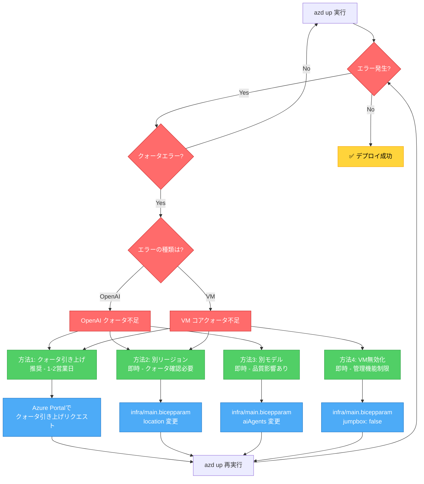

# Azure クォータエラーのトラブルシューティング

このガイドでは、`azd up` デプロイ時に発生する可能性のあるAzureクォータエラーとその解決方法を説明します。

---

## エラーの種類

デプロイ中に以下のクォータ不足エラーが発生する可能性があります：

### 1. Azure OpenAI クォータ不足

**エラーメッセージ**:
```
InsufficientQuota: This operation require 10 new capacity in quota
Tokens Per Minute (thousands) - gpt-4o - GlobalStandard,
which is bigger than the current available capacity 0.
The current quota usage is 50 and the quota limit is 50
```

**原因**:
- Azure OpenAIのトークン/分 (TPM) クォータが上限に達している
- 特定のモデル（GPT-4o, GPT-4, GPT-3.5など）のクォータが不足

**影響を受けるリソース**:
- Azure OpenAI Service
- AI Foundry プロジェクト
- デプロイされるAIモデル

---

### 2. 仮想マシン (VM) クォータ不足

**エラーメッセージ**:
```
QuotaExceeded: Operation could not be completed as it results in
exceeding approved standardDASv5Family Cores quota.
Current Limit: 0, Current Usage: 0, Additional Required: 4
```

**原因**:
- Jumpbox VM用のVMコアクォータが不足
- 特定のVMファミリー（DASv5, DSv3など）のクォータが0または不足

**影響を受けるリソース**:
- Jumpbox VM (管理用仮想マシン)

---

## 解決方法

### 方法1: クォータ引き上げリクエスト（推奨）

#### Azure Portal経由

1. **Azure Portal にアクセス**
   - [Azure Portal](https://portal.azure.com) にサインイン

2. **クォータページに移動**
   - 検索バーで「クォータ」を検索
   - 「クォータ」サービスを選択

3. **OpenAI クォータの引き上げ**
   - 「Azure OpenAI」を選択
   - 該当するリージョン（例: East US 2）を選択
   - モデル（例: gpt-4o）を選択
   - 「新しいクォータ要求」をクリック
   - 必要なTPM容量を入力（推奨: 最低 50K TPM、理想: 100K TPM）
   - ビジネス上の正当な理由を記入
   - 送信

4. **VM コアクォータの引き上げ**
   - 「コンピュート」を選択
   - 該当するリージョン（例: East US 2）を選択
   - VMファミリー（例: standardDASv5Family）を選択
   - 「新しいクォータ要求」をクリック
   - 必要なコア数を入力（推奨: 最低 4 cores、理想: 8 cores）
   - 送信

**処理時間**: 通常1-2営業日（緊急の場合は1時間以内の場合もあり）

---

#### Azure CLI経由

Azure CLIでクォータ引き上げをリクエスト:

```bash
# OpenAI クォータ引き上げリクエスト
az rest --method post \
  --uri "https://management.azure.com/subscriptions/<subscription-id>/providers/Microsoft.Support/supportTickets?api-version=2020-04-01" \
  --body '{
    "properties": {
      "serviceId": "/providers/Microsoft.Support/services/quota_service_guid",
      "severity": "minimal",
      "title": "Azure OpenAI Quota Increase Request",
      "problemClassificationId": "/providers/Microsoft.Support/services/quota_service_guid/problemClassifications/problem_classification_guid",
      "description": "Request to increase Azure OpenAI TPM quota for gpt-4o model in East US 2 region"
    }
  }'

# VM コアクォータ引き上げリクエスト
az vm list-usage --location eastus2 -o table
```

---

### 方法2: 別のリージョンにデプロイ

クォータが利用可能な別のリージョンにデプロイ:

#### ステップ1: リージョンのクォータ確認

```bash
# OpenAI利用可能リージョンを確認
az account list-locations -o table | grep -E "eastus|westus|northeurope|westeurope"

# 各リージョンのOpenAIクォータを確認
az cognitiveservices account list-usages \
  --name <openai-account-name> \
  --resource-group <resource-group>
```

#### ステップ2: パラメータファイルを更新

`infra/main.bicepparam` を編集:

```bicep
// 元のリージョン
// param location = 'eastus2'

// クォータが利用可能なリージョンに変更
param location = 'westus'  // または 'northeurope', 'swedencentral' など
```

#### ステップ3: 再デプロイ

```bash
azd up
```

**推奨リージョン** (OpenAIクォータが比較的利用可能):
- West US
- North Europe
- Sweden Central
- France Central
- UK South

---

### 方法3: 別のAIモデルを使用

GPT-4oの代わりに、クォータが利用可能な別のモデルを使用:

#### オプションA: GPT-4 Turbo

`infra/main.bicepparam` を編集:

```bicep
param aiAgents = [
  {
    name: 'gpt-4-turbo'
    deploymentName: 'gpt-4-turbo'
    model: {
      format: 'OpenAI'
      name: 'gpt-4'
      version: '1106-Preview'  // または '0125-Preview'
    }
    sku: {
      name: 'Standard'
      capacity: 10  // TPM (thousands)
    }
  }
]
```

#### オプションB: GPT-3.5 Turbo

```bicep
param aiAgents = [
  {
    name: 'gpt-35-turbo'
    deploymentName: 'gpt-35-turbo'
    model: {
      format: 'OpenAI'
      name: 'gpt-35-turbo'
      version: '1106'
    }
    sku: {
      name: 'Standard'
      capacity: 10
    }
  }
]
```

**注意**: モデルを変更すると、AIの応答品質に影響する可能性があります。

---

### 方法4: Jumpbox VMを無効化（一時的）

管理用VMが不要な場合、一時的に無効化:

#### `infra/main.bicepparam` を編集:

```bicep
// Jumpbox VMを無効化
param deployToggles = {
  jumpbox: false  // これを追加
}
```

**注意**:
- Jumpbox VMを無効化すると、プライベートリソースへのアクセスが制限されます
- Bastion経由でのVM管理ができなくなります
- 本番環境では推奨されません

---

## クォータの事前確認

デプロイ前にクォータを確認する方法:

### Azure OpenAI クォータ確認

```bash
# サブスクリプションのOpenAIクォータを確認
az cognitiveservices usage list \
  --location eastus2 \
  --subscription <subscription-id>

# または、ポータルで確認
# Azure Portal > Cognitive Services > Quotas
```

### VM コアクォータ確認

```bash
# リージョンのVM使用状況を確認
az vm list-usage --location eastus2 -o table

# 特定のVMファミリーのクォータを確認
az vm list-usage --location eastus2 --query "[?localName=='Standard DASv5 Family vCPUs']" -o table
```

### 推奨クォータ

このソリューションアクセラレータをデプロイするための推奨クォータ:

| リソース | 推奨クォータ | 最小クォータ |
|---------|-------------|-------------|
| **Azure OpenAI - GPT-4o** | 100K TPM | 50K TPM |
| **Azure OpenAI - Embeddings** | 50K TPM | 30K TPM |
| **Standard DASv5 Family Cores** | 8 cores | 4 cores |
| **Total Regional vCPUs** | 20 cores | 10 cores |
| **Standard Storage Accounts** | 5 | 3 |
| **Virtual Networks** | 5 | 2 |

---

## よくある質問

### Q1: クォータ引き上げリクエストにはどのくらい時間がかかりますか？

**A**: 通常1-2営業日ですが、以下の要因で変動します：
- サポートチケットの緊急度
- リクエスト内容の妥当性
- リージョンのキャパシティ
- アカウントの履歴

### Q2: クォータ引き上げは必ず承認されますか？

**A**: 以下の場合は承認される可能性が高いです：
- ビジネス上の明確な正当性がある
- 適切な使用計画が説明されている
- リージョンにキャパシティがある
- アカウントが良好な状態

拒否される場合：
- リージョンのキャパシティ不足
- 不適切な使用計画
- アカウントの支払い問題

### Q3: 複数のリージョンにデプロイできますか？

**A**: はい、可能です。ただし：
- 各リージョンで個別にクォータが必要
- レイテンシーとデータ主権を考慮
- コストが増加する可能性

### Q4: クォータはサブスクリプション全体で共有されますか？

**A**: リソースによって異なります：
- **Azure OpenAI**: リージョン + モデル単位
- **VM Cores**: リージョン + VMファミリー単位
- **Storage Accounts**: リージョン単位

### Q5: エラーメッセージに複数のクォータ不足が表示されます。全て解決する必要がありますか？

**A**: はい、デプロイを成功させるには、すべてのクォータエラーを解決する必要があります。

---

## サポートリソース

### クォータ管理ツール

- [Azure Quotas Portal](https://portal.azure.com/#view/Microsoft_Azure_Capacity/QuotaMenuBlade)
- [Azure OpenAI Quota Management](https://oai.azure.com/portal/quota)
- [Quota Check CLI Tool](./quota_check.md)

### ドキュメント

- [Azure OpenAI Quota Management](https://learn.microsoft.com/azure/ai-services/openai/quotas-limits)
- [Virtual Machine Quotas](https://learn.microsoft.com/azure/virtual-machines/quotas)
- [Quota Increase Requests](https://learn.microsoft.com/azure/quotas/quickstart-increase-quota-portal)

### サポートチャネル

- [Azure Support](https://azure.microsoft.com/support/create-ticket/)
- [Azure Community Forums](https://learn.microsoft.com/answers/products/azure)
- [GitHub Issues](https://github.com/microsoft/Deploy-Your-AI-Application-In-Production/issues)

---

## トラブルシューティングフローチャート



---

## 追加の注意事項

### コスト最適化

クォータ引き上げはコストに影響します:

- **OpenAI TPM**: 従量課金（使用した分だけ課金）
- **VM Cores**: 稼働時間に応じて課金
- **Storage**: 保存データ量に応じて課金

### セキュリティ考慮事項

- Jumpbox VMを無効化する場合、プライベートリソースへの別のアクセス方法を確保してください
- クォータ引き上げリクエストには、セキュリティとコンプライアンスの要件を含めてください

### 本番環境への展開

本番環境では:
- 十分なクォータバッファを確保（推奨: 使用量の2倍）
- 複数リージョンでのフェイルオーバーを検討
- クォータ監視アラートを設定
- 定期的なクォータレビューを実施

---

**更新日**: 2026-01-19
**バージョン**: 1.0
